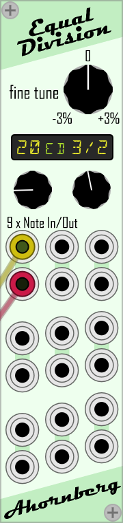

# Ahornberg-Microtonal

If you like it, feel free to support futher development https://www.paypal.me/Ahornberg/10

## EqualDivision

Module for VCV-Rack to convert Note CV in Standard Western Tuning (1 step equals 100 cents) to several Equal Division Tunings.

### Fine Tune
Makes it possible to compress or stretch a tuning in a range from -3 to +3 percent.
### Display
Shows the actual selected tuning.
#### Interval
The yellow digit or fraction on the right side stands for the interval the tuning is based on.
Possible values are
* 9/8 .. a just intonated Major Second (aka. Major Whole Tone).
* 8/7 .. a just intonated Supermajor Second (aka. Septimal Whole Tone or Dimished Third) .. 231.174 cents
* 7/6 .. a just intonated Subminor Third (aka. Septimal Minor Third´or Augmented Second) .. 266.871 cents
* 6/5 .. a just intonated Minor Third .. 315.641 cents
* 5/4 .. a just intonated Major Third .. 386.314 cents
* 4/3 .. a just intonated Perfect Fourth .. 498.045 cents
* 3/2 .. a just intonated Perfect Fifth .. 701.955 cents
* 2 .. an Ocatve .. 1200.000 cents
* 3 .. a Tritave or Duodecime (an Octave and a just intonated Perfect Fifth) .. 1901.955 cents
* 4 .. a Double Octave (two Octaves) .. 2400.000 cents
* 5 .. a Just Major 17th (two Octaves and a just intonated Major Third) .. 2786.314 cents
* 6 .. two Octaves and a just intonated Perfect Fifth .. 3101.955 cents
* 7 .. the 7th Natural (two Octaves and a just intonated Subminor Seventh, aka. Harmonic Seventh) .. 3368.826 cents
* 8 .. three Octaves .. 3600.000 cents
#### ED
The green letters ED stand for Equal Division.
#### Number Of Equal Steps
The yellow digits on the left side display the number of equal steps the interval is divided in.
### 9 x Note In/Out
Nine vertically orientated pairs of Note CV inputs and outputs provide the a bility to tune 9 different signals simultaneously using only one module. The outputs are hard limited to -5/+5 Volts.
## Further Readings
http://xenharmonic.wikispaces.com/Equal-step+Tuning 

Happy tuning!

Ahornberg
