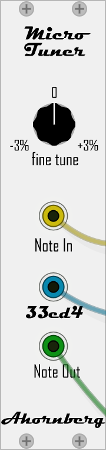

# Ahornberg-Microtonal

Module for VCV-Rack to play microtonal in Equivocal Tuning, see http://xenharmonic.wikispaces.com/33ed4 or in 12edo (western standard tuning) with stretched or compressed octaves.

Windows binary can be downloaded at https://github.com/Ahornberg/Ahornberg-Microtonal/issues/4
Thanks to Clément Foulc for the Mac binary https://github.com/Ahornberg/Ahornberg-Microtonal/issues/2

Thanks to Zulu Echo Romeo-Oscar for the Linux binary https://github.com/Ahornberg/Ahornberg-Microtonal/issues/3

