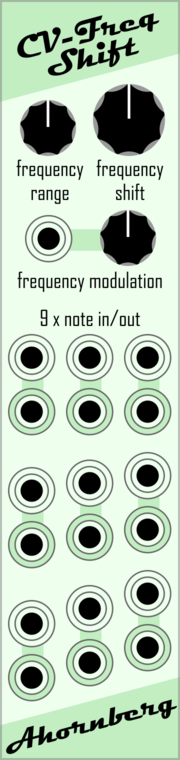

# Ahornberg-VCV-Modules

## Manuals

# Ahornberg Music Tools
## Why
To help people to have more fun during the process of making music.
## How
By creating unique hard- and software that provides the look and feel of working with iconic analog devices as add-ons to well-known music production environments.
## What
* VCV Rack Modules
* VST Plugins
* Reason Rack Extensions
* Apps for Mobile Devices
* Ardouino and Raspberry Pi based DIY-hardware
