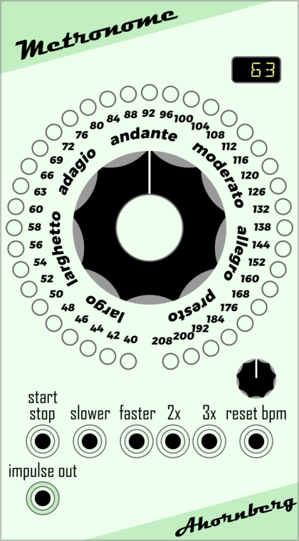

# Manuals for Ahornberg-VCV-Modules

## Equal Division

Module for VCV-Rack to convert Note CV in Standard Western Tuning (12ed2 = 1 step equals 100 cents) to several Equal Division Tunings.

### Fine Tune
Makes it possible to compress or stretch a tuning in a range from -3 to +3 percent.
### Display
Shows the actual selected tuning.
#### Interval
The yellow digit or fraction on the right side stands for the interval the tuning is based on.
Possible values are
* 9/8 .. a just intonated Major Second (aka. Major Whole Tone).
* 8/7 .. a just intonated Supermajor Second (aka. Septimal Whole Tone or Dimished Third) .. 231.174 cents
* 7/6 .. a just intonated Subminor Third (aka. Septimal Minor Third´or Augmented Second) .. 266.871 cents
* 6/5 .. a just intonated Minor Third .. 315.641 cents
* 5/4 .. a just intonated Major Third .. 386.314 cents
* 4/3 .. a just intonated Perfect Fourth .. 498.045 cents
* 3/2 .. a just intonated Perfect Fifth .. 701.955 cents
* 2 .. an Ocatve .. 1200.000 cents
* 3 .. a Tritave or Duodecime (an Octave and a just intonated Perfect Fifth) .. 1901.955 cents
* 4 .. a Double Octave (two Octaves) .. 2400.000 cents
* 5 .. a Just Major 17th (two Octaves and a just intonated Major Third) .. 2786.314 cents
* 6 .. two Octaves and a just intonated Perfect Fifth .. 3101.955 cents
* 7 .. the 7th Natural (two Octaves and a just intonated Subminor Seventh, aka. Harmonic Seventh) .. 3368.826 cents
* 8 .. three Octaves .. 3600.000 cents
#### ED
The green letters ED stand for Equal Division.
#### Number Of Equal Steps
The yellow digits on the left side display the number of equal steps the interval is divided in.
### 9 x Note In/Out
Nine vertically orientated pairs of Note CV inputs and outputs provide the ability to tune 9 x 16 = 144 different signals simultaneously using only one module.
### Further Readings
https://en.xen.wiki/w/Equal-step_tuning

https://en.xen.wiki/w/33ed4

Happy tuning!

Microtonal music by Ahornberg: https://soundcloud.com/ahornberg/sets/equivocal-tuning-33ed4

## CV-Frequency Shift

A linear frequency shifter for CV note pitch signals.

The input is taken as a CV-pitch value and is transformed to frequency in Hz, e.g. 0 Volts input = note C4 = 261.63 Hz, then let’s say + 108.36 Hz will be applied, this results in 369.99 Hz = F#4. But if I would have taken C5 = 523.26 Hz as input, by applying the same + 108.36 Hz leads to 631.62 Hz and this frequency lies between D#5 and E5.

So it is a linear frequency shift, of course only on the base frequency, not on overtones that might be produced by VCOs afterwards. The intention is to use VCOs that produce sine waves. The module can calc 9 x 16 = 144 values simultaneously, so enough to build complex sounds with inharmonic overtones based on sinewaves.

This module complements the Harmonizer module.

How to use it:

### Root Octave

### Frequency Shift

### Frequency Modulation

### 9 x Note In/Out
Nine vertically orientated pairs of Note CV inputs and outputs provide the ability to tune 9 x 16 = 144 different signals simultaneously using only one module.

## Tape Recorder

Coming soon.

## Metronome

A virtual rebuild of a vintage electronic metronome.

How to use it:

## Harmonizer

A virtual rebuild of a vintage electronic metronome.

How to use it:

